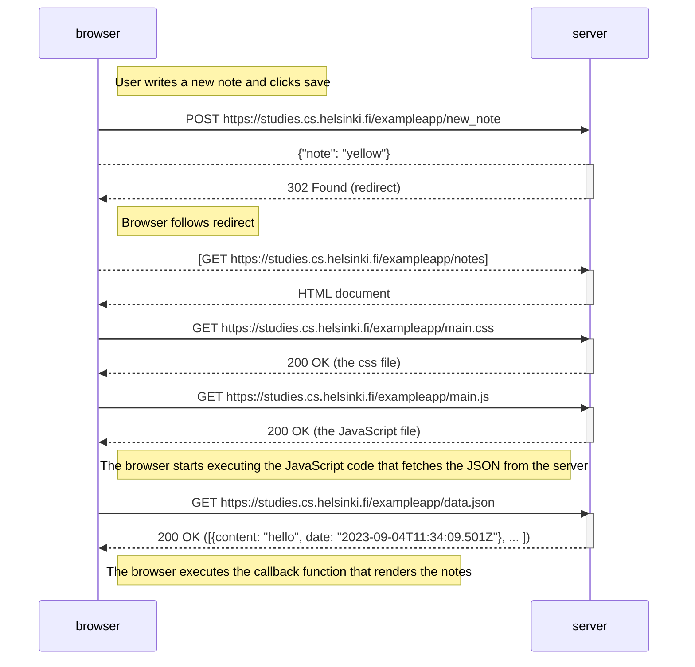

```mermaid
sequenceDiagram
    participant browser
    participant server

    Note right of browser: User writes a new note and clicks save
    browser->>server: POST https://studies.cs.helsinki.fi/exampleapp/new_note
    browser --> server: {"note": "yellow"}
    activate server
    server-->>browser: 302 Found (redirect)
    deactivate server

    Note right of browser: Browser follows redirect
    browser-->>server: [GET https://studies.cs.helsinki.fi/exampleapp/notes]
    activate server
    server-->>browser: HTML document
    deactivate server

    browser->>server: GET https://studies.cs.helsinki.fi/exampleapp/main.css
    activate server
    server-->>browser: 200 OK (the css file)
    deactivate server

    browser->>server: GET https://studies.cs.helsinki.fi/exampleapp/main.js
    activate server
    server-->>browser: 200 OK (the JavaScript file)
    deactivate server

    Note right of browser: The browser starts executing the JavaScript code that fetches the JSON from the server
    browser->>server: GET https://studies.cs.helsinki.fi/exampleapp/data.json
    activate server
    server-->>browser: 200 OK ([{content: "hello", date: "2023-09-04T11:34:09.501Z"}, ... ])
    deactivate server

    Note right of browser: The browser executes the callback function that renders the notes
```
