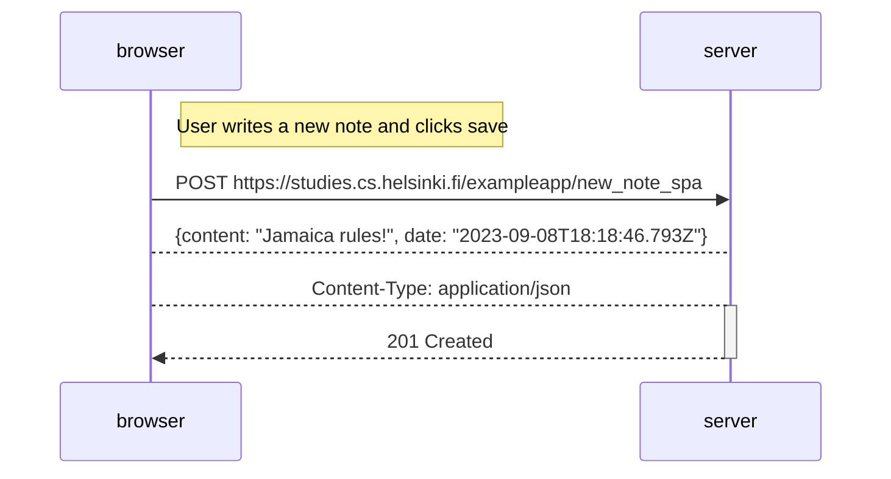

```mermaid
sequenceDiagram
    participant browser
    participant server

    Note right of browser: User writes a new note and clicks save
    browser->>server: POST https://studies.cs.helsinki.fi/exampleapp/new_note_spa
    browser --> server: {content: "Jamaica rules!", date: "2023-09-08T18:18:46.793Z"}
    browser --> server: Content-Type: application/json;
    activate server
    server-->>browser: 201 Created
    deactivate server
```
